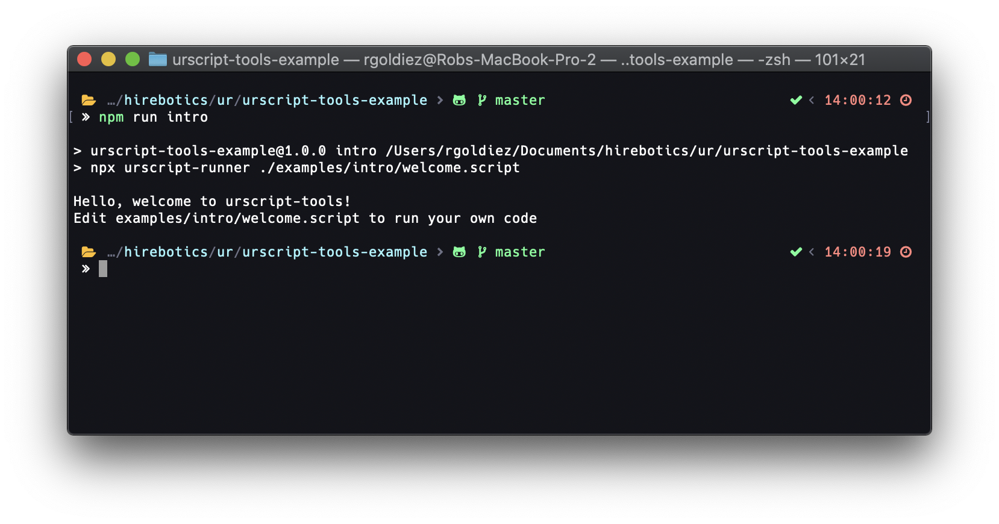

<p>
  <a href="#"></a>
  <a href="https://twitter.com/intent/follow?screen_name=Hirebotics"></a>
</p>

<h1 align="center">URScript Tools</h1>
<h2 align="center">A set of tools built around URScript to make your development easier</h2>

## Table of Contents

- [Overview](#overview)
- [Quick Start](#quick-start)
- [Documentation](#documentation)
  - [URScript Runner](#URScript-Runner)
  - [URScript Bundler](#URScript-Bundler)
  - [URScript Tester](#URScript-Tester)
    - [Test Syntax](#Test-Syntax)
    - [Mock Syntax](#Mock-Syntax)
    - [Additional Functions](#Additional-Functions)

## Overview

URScript Tools is a suite of tools aimed to enhance the developer experience around URScript. These tools allow you to run URScript locally against a URController without the need for a cobot or a complicated VM setup.

**Platform Support**

- Mac OS X
- Linux
- Windows is not supported at this time

## Quick Start

To get started we need to install a few dependencies

- Install [`nodejs`](https://nodejs.org/en/download/)
- Install [`docker`](https://www.docker.com/products/docker-desktop)
- Clone [`URScript Tools Example Project`](https://github.com/Hirebotics/urscript-tools-example.git)

```bash
git clone https://github.com/Hirebotics/urscript-tools-example.git
cd urscript-tools-example
npm i
npm run intro
```

Note: The first execution might take a while as the Docker image for the URController is downloaded.

Output:

```bash
Hello, welcome to urscript-tools!
```

<p></p>

Congrats! Your environment is now setup to run urscript tools. Browse the example project to see advanced usage
on how to use each of the tools

## Documentation

### URScript Runner

The script runner allows you to run a single script file that has no external dependencies

Basic Usage:

```bash
npx urscript-runner <file>
```

Config:

By default, `urscript-runner` will run with logical defaults. To customize the config you can add `runner.config.json` to the root of your project or specify the config file with the `--config` switch

Custom Configuration

```bash
npx urscript-runner --config runner.config.json
```

Example configurations

- [Simple Configuration](src/examples/runner.config.simple.json)
- [Advanced Configuration](src/examples/runner.config.full.json)

### URScript Bundler

The script bundler allows you to manage your source code in a logical directory structure and then have it bundled into a single script file that can be served using `urscript-runner` or manually deployed to your cobot.

Basic Usage:

```bash
npx urscript-bundler --config bundle.config.json
```

Example configuration

- [Simple Configuration](src/examples/bundle.config.simple.json)

Refer to the [`URScript Tools Example Project`](https://github.com/Hirebotics/urscript-tools-example.git) for a real example of how you can structure a project

#### Addtional Notes

The bundler supports copying static assets such as a URP, installation file, or any other file type you want delivered with your script

### URScript Tester

The script tester provides the ability to write unit tests against your URScript code. Writing unit tests can be a great way to ensure your code works before deploying to production and this process can easily be integrated into your existing build processes.

#### Features

- Unit test
  - Each test file can contain multiple unit tests and the test framework can match against wildcard patterns to execute tests
  - Controller prints output directly to the console
- Mock support
  - Allows the user to mock any built-in or custom urscript function for testing purposes
- Additional Capabilities
  - Before Each
    - Invoke logic before each test
  - After Each
    - Invoke logic after each test
  - Assert Equal
  - Configurable test execution timeout

Example configuration

- [Simple Configuration](src/examples/urtester.config.simple.json)
- [Advanced Configuration](src/examples/urtester.config.full.json)

#### Test Syntax

`test_<myTestName>`

Example Test:

```
def add(val1, val2):
  return val1 + val2
end

def test_add():
  local result = add(5, 5)

  assertEqual(
    name = "add - equals",
    result = result,
    expected = 10
  )
end
```

Sample Usage:

```Bash
npx urscript-tester --config ./examples/test-basic/urtester.config.json ./examples/test-basic/__tests__/*
```


Sample Results:


<p></p>

#### Mock Syntax

`mock_<functionNameToReplace>`

Example Mock:

```
local signalLevel = True

def mock_get_standard_digital_in(index):
  return signalLevel
end

def test_getStandardDigitalIn_True():

  # force a return value of True for our mock
  signalLevel = True

  local result = get_standard_digital_in(0)

  assertEqual(
    name = "validate signal level - true",
    result = result,
    expected = signalLevel
  )

end

def test_getStandardDigitalIn_False():

  # force a return value of False for our mock
  signalLevel = False

  local result = get_standard_digital_in(0)

  assertEqual(
    name = "validate signal level - false",
    result = result,
    expected = signalLevel
  )

end
```

#### Additional Functions

##### Before Each / After Each

Optional: Define a `beforeEach()` and/or `afterEach()` functions in your test file to setup and teardown
any additional config for your unit test. A common usage would be to track invocations of a mocked function
where you might want to reset the invocation count variable after each test case is invoked.

```
  def beforeEach():
    # setup for test
  end

  def afterEach():
    # teardown for test
  end
```

##### Increase test execution timeout

By default, each test will timeout after 10 seconds. You can increase this timeout by invoking `setTestExecutionTimeout` at the beginning of your test

Example:

```
  def test_withIncreasedTimeout():
    setTestExecutionTimeout(20000)

    # do work here
  end
```
